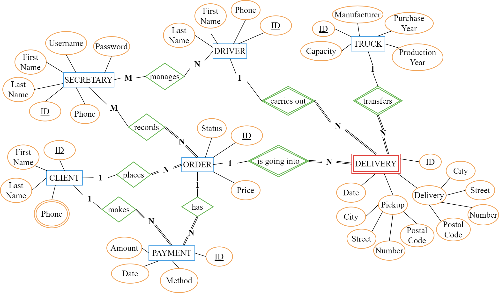

# <h1 style="text-align: center"> Database Project - Moving Company Management System
---
---
## ☰ Contents
  [**_1. Project Description_**](#1-project-description)
  
  [**_2. Project Overview_**](#2-project-overview)
 
  [**_3. Basic Structure_**](#3-basic-structure)
  
  - [**_Entity Relation Diagram_**](#31-entity-relation-diagram)

  [**_4. Tools Used_**](#4-tools-used)
  
## 1. Project Description 
📄 As a part of our university curriculum, we made this project for "Databases (DB)". This project combines theory with practical **_SQL_** implementation. In this project, I collaborated with my team (**Nefeli & Thanasis 🫂**) to develop a <i>real-world</i> 📦🚛 Moving Company Management System for a small business

## 2. Project Overview
🎯We started by designing the  `Entity-Relationship Diagram [ERD]`, then created the `Relational Model [RM]`, and finally implemented the project. The project involved the creation of multiple tables and meticulous data management in MySQL. The project included making *tables*, *views*, *indexes*, *transactions*, *cursors*, *triggers*, and *stored procedures* in MySQL. We also developed a `dynamic website`.

## 3. Basic Structure

🔎 Click here to see the basic structure of the project! 🖱️

#### **Identification of Entities:**
⇾ **Secretary**
  
<ins>Attributes: id, firstName, lastName, username, password, phone</ins>
 
⇾ **Client**  
<ins>Attributes: id, firstName, lastName, phone</ins>
 
⇾ **Driver**  
<ins>Attributes: id, firstName, lastName, phone</ins>
 
⇾ **Orders**  
<ins>Attributes: id, price, status</ins>
 
⇾ **Delivery** 
<ins>Attributes: id, date, pCity, pStreet, pNumber, pPostalCode, dCity, dStreet, dNumber, dPostalCode</ins>
 
⇾ **Truck**  
<ins>Attributes: id, manufacturer, capacity, purchaseYear, productionYear</ins>
 
⇾ **Payment**  
<ins>Attributes: id, amount, method, date</ins>

### Entity Relation Diagram

## 4. Tools Used

   

  

 
 

